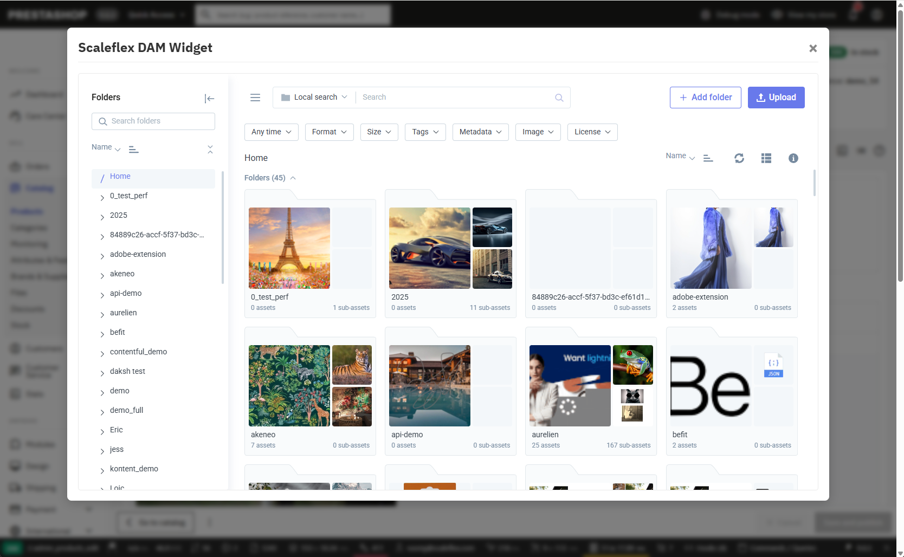
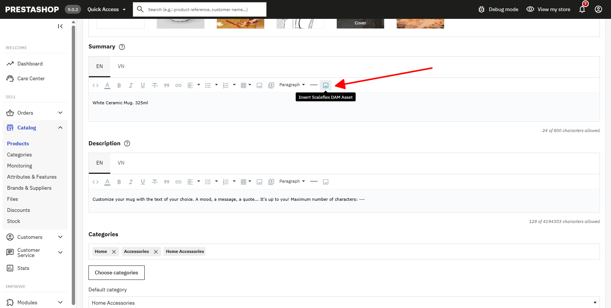

# Scaleflex DAM

## Limitation

- Only support Product Media and TinyMCE default version(Without other TinyMCE Plugin modification)
- Only support Prestashop from version 9.0.0-1.0

## Download Scaleflex DAM module

- Step 1: Download the latest version [Download Latest release of Module](https://github.com/scaleflex/prestashop-filerobot-plugin/releases)
- Step 2: Unzip the file and change the folder name to "scaleflexdam"
- Step 3: Zip the file with the name "scaleflexdam.zip"
- Step 4: In Admin go to Modules/Module Manager -> Upload the Zipped file

## Installation

- Step 1: In Admin go to Modules/Module Catalog search for "Scaleflex DAM"
- Step 2: Click "Install"
- Step 3: Go to Modules/Module Manager -> Other Section -> Click on Configure on "Scaleflex DAM"
  
- Step 4: Update configuration and activate the Module, then your site is ready to go.
  

## Configuration

- Activation: Enable/Disable the module
- Token: Your Scaleflex DAM Token
- Security Template: Your Scaleflex DAM security template
- Upload Directory: The directory where you want to manage assets
- Transformations: Enable/Disable the transformation
- AI Asset Search: Enable/Disable the AI asset search

## User guide

### Product media
- Go to Catalog/Product -> Click ```+``` button in Product Images

- Choose images and click ```Insert```

### Product WYSIWYG
- Click ```image``` icon on WYSIWYG

- The same as Product Media click ```Insert``` after choose your images
